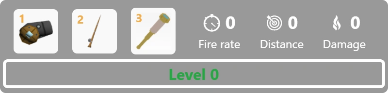

# Upgrades

In Krew.io, there are 3 main upgrades you can add skill points, which are earned by gaining XP from farming crabs and shells, fishing, or killing other players and [Ships](/pages/ships.md).

The 3 upgrades to choose from are [Fire Rate](/pages/upgrades/firerate.md), [Distance](/pages/upgrades/distance.md), and [Damage](/pages/upgrades/damage.md), which you can either upgrade by hitting the red triangles above the stats, or by pressing `5`, `6`, or `7`.

A few important things to note:

- Your level is capped at 50.
- Once the point is chosen between the 3 upgrades, it cannot be changed.

Strategical facts to note:

- A maxed out damage stat amounts to only about 3 extra damage per shot.
- Just the right amount of distance can provide long-range benefits.
- A large fire rate works perfectly in accordance with the [Demolisher](/items/cannon/demolisher.md)

